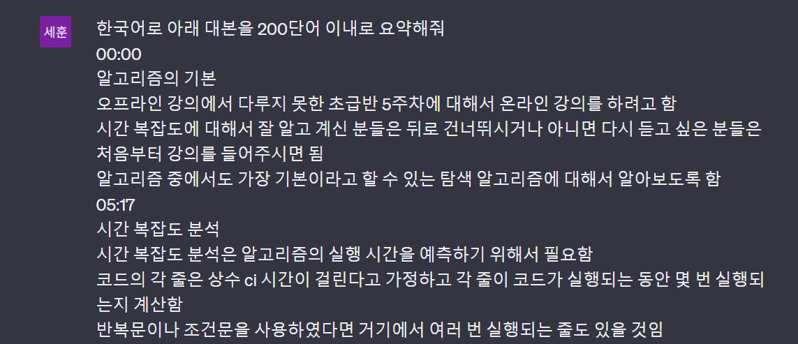

## 임세훈  

### 개요

- 노트 주제: <a href = "https://www.youtube.com/watch?v=v2PCwaawA8o">ALOHA 5주차 알고리즘 강의 </a> 보완하기
- 노트 제목: 완전 탐색, 정렬, 이진 탐색, 시간 복잡도 강의
- 노트 공유 링크: <a href = "https://clovanote.naver.com/home/note/16372042-4955-4b3b-a293-d0d24d0e587en">링크</a>
- ChatGPT 활용 방법: 
    - 대본 요약하기: 1시간 가량 되는 대본을 클로바노트를 이용하여 요약하였지만, **200단어 이내로 추가로 요약**하라는 질문을 했습니다.
  
    
   - 내용 보완하기: 알로하 5주차 강의를 온라인으로 제공한 이유가 내용이 너무 어려워서였는데, **어떻게 하면 내용을 보완할 수 있을까**에 대해 물어봤습니다.

---

### 사진

